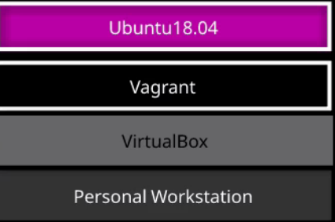

# vagrant

Vagrant 是为了方便的实现虚拟化环境而设计的，使用Ruby 开发，基于VirtualBox 等虚拟机管理软件的接口，提供了一个可配置、轻量级的便携式虚拟开发环境. 使用Vagrant 可以很方便的就建立起来一个虚拟开发环境，而且可以模拟多台虚拟机，这样可以配置不同devops场景进行高效训练.

&#x20;                                              

## QA

### 为什么不用docker配置训练场景

docker主要用于生产环境中,用于在进程水平上进行资源的隔离, 但必须与宿主机共享系统内核, 而vagrant能够在不同系统内核下使用不用的虚拟机, 能够跟好的适应devops训练中遇到的场景.&#x20;
